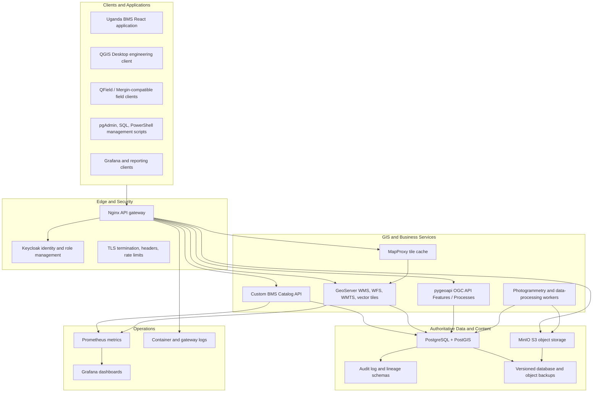
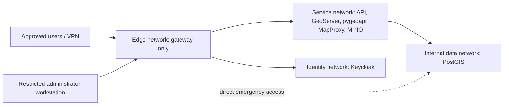
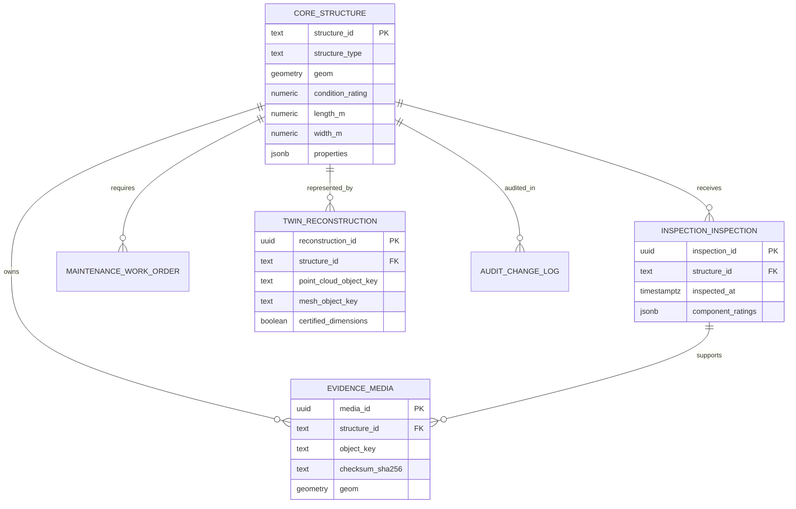
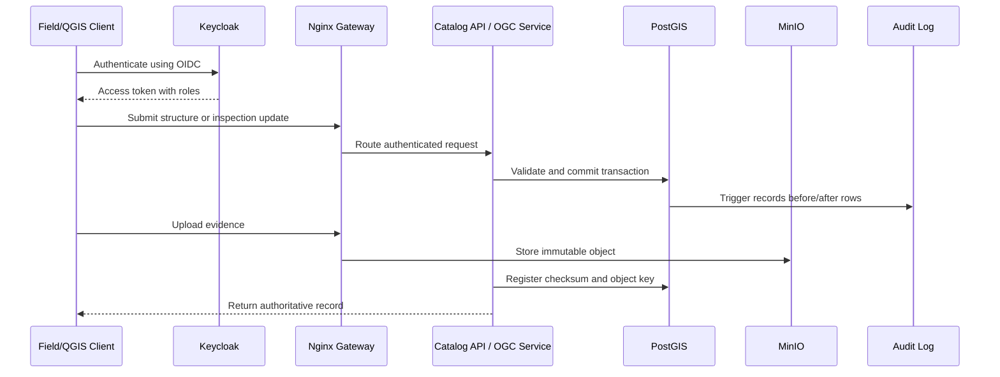

# Uganda BMS Open-Source Enterprise GIS Architecture

## Objective

The enterprise GIS stack provides the capabilities normally expected from a proprietary enterprise GIS platform while using only open-source software and open standards. It separates authoritative data, geospatial services, applications, identity, storage, monitoring, and administrative repair tools so that each layer can be upgraded or replaced independently.

The implementation scaffold is in `enterprise-gis/`. It runs with Docker Compose on a workstation, virtual machine, or server cluster. The public GitHub Pages application remains a read-only distribution channel and is not the authoritative database.

## Complete Layer Model



## Service Inventory

| Layer | Service | Purpose | Open-source status |
| --- | --- | --- | --- |
| Gateway | Nginx | Single entrypoint, routing, TLS, response headers | BSD-2-Clause |
| Identity | Keycloak | Users, groups, roles, OIDC and service accounts | Apache-2.0 |
| Database | PostgreSQL | Transactions, constraints, role management, audit | PostgreSQL License |
| Spatial database | PostGIS | Geometry, spatial indexes, analysis and topology | GPL-2.0-or-later |
| GIS publishing | GeoServer | WMS, WFS, WMTS, vector tiles, styles | GPL-2.0 |
| Modern OGC API | pygeoapi | OGC API Features and process endpoints | MIT |
| Tile caching | MapProxy | Cached WMTS/TMS/WMS services | Apache-2.0 |
| Object storage | MinIO | Photos, point clouds, meshes, reports and exports | AGPL-3.0 |
| Database admin | pgAdmin | SQL, schema inspection, repair and backup UI | PostgreSQL License |
| Monitoring | Prometheus | Service and infrastructure metrics | Apache-2.0 |
| Dashboards | Grafana OSS | Operational monitoring dashboards | AGPL-3.0 |
| Desktop GIS | QGIS | Editing, styling, analysis and print layouts | GPL-2.0 |
| Field capture | QField | Offline spatial inspection workflows | GPL-2.0 |
| Custom service | BMS Catalog API | Structure, audit and layer management endpoints | Project-owned |

There are no per-user or per-server proprietary license fees. Hosting, backup media, internet, support labor, and infrastructure still have operational costs.

## Network and Trust Zones



- The `data` and `identity` Docker networks are internal and cannot be reached directly from outside the host.
- Only the Nginx gateway publishes a host port.
- Production deployment should place the gateway behind organizational TLS and a firewall or VPN.
- Direct database access should be limited to approved administrators and QGIS editor accounts.

## Published Interfaces

| Gateway path | Service | Use |
| --- | --- | --- |
| `/api/` | Custom Catalog API | BMS-specific queries, repairs, audit history |
| `/geoserver/` | GeoServer | WMS, WFS, WMTS and vector tiles |
| `/ogc/` | pygeoapi | Modern OGC API collections and processes |
| `/tiles/` | MapProxy | Cached map tiles |
| `/identity/` | Keycloak | OIDC login and administration |
| `/objects/` | MinIO | Evidence and digital-twin objects |
| `/storage-admin/` | MinIO Console | Restricted storage administration |
| `/database-admin/` | pgAdmin | Restricted database management |
| `/monitoring/` | Grafana | Service health and usage |
| `/metrics/` | Prometheus | Raw metrics, restricted in production |

## Applications, Extensions, and Plugins

The platform is intentionally extensible through documented interfaces rather than a proprietary plugin marketplace.

| Extension point | Recommended implementation | Examples |
| --- | --- | --- |
| QGIS desktop plugins | Python + PyQGIS | Structure locator, inspection validation, bulk attribute repair, report generation |
| GeoServer extensions | Official GeoServer extension modules | Vector tiles, OGC API Features, CSS styling |
| OGC processing plugins | pygeoapi process providers | Condition scoring, route-chainage placement, maintenance prioritisation |
| Backend modules | Catalog API routes or independent services | Import validation, twin registry, audit reporting |
| Database functions | Versioned SQL migrations | Spatial validation, rating calculations, change triggers |
| Field forms | QGIS/QField project forms | Offline inspection capture and evidence attachment |
| Viewer tools | React components using OGC/API contracts | Point-cloud viewer, structure comparison, maintenance planner |
| Scheduled jobs | Container cron, system scheduler, or workflow engine | Backups, photo ingestion, tile seeding, health reports |

Custom extensions must use service accounts with the least required role, write through transactions, and record provenance. A plugin must never bypass audit controls by writing directly to untracked files.

## Database Domain Layout



Schemas and ownership:

- `core`: authoritative structures and road links.
- `inspection`: inspections, component ratings and findings.
- `maintenance`: work orders and intervention delivery.
- `evidence`: source media metadata and object-storage keys.
- `twin`: point-cloud and textured-mesh reconstruction registry.
- `integration`: stable read-only views published to GIS services.
- `audit`: immutable row-change history.

## Database Management Plan

### Roles

- `gis_readonly`: approved analysts and reporting tools.
- `gis_editor`: controlled structure and inspection editing.
- `gis_service`: read-only service account used by publishing services.
- `gis_maintainer`: senior database repair role.
- Database owner: used only for migrations, extensions and disaster recovery.

### Change management

1. Apply schema changes as numbered SQL migration files.
2. Test migrations against a restored copy of production.
3. Back up before every migration.
4. Execute using the database owner.
5. Verify integration views, spatial indexes and service health.
6. Record the release and operator in the change register.

### Direct repair without the BMS frontend

Administrators can repair data using:

```powershell
.\enterprise-gis\scripts\manage.ps1 status
.\enterprise-gis\scripts\manage.ps1 sql -Sql "SELECT structure_id, name FROM core.structure WHERE structure_id='B001';"
.\enterprise-gis\scripts\manage.ps1 sql -Sql "UPDATE core.structure SET name='Corrected name', updated_at=now() WHERE structure_id='B001';"
```

Or connect QGIS directly to PostGIS for spatial edits and pgAdmin for table, role, query, and backup management. Every structure and inspection change is recorded in `audit.change_log`.

### Backup policy

- Nightly PostgreSQL custom-format backup.
- Retain 30 daily, 12 monthly, and 7 annual backups.
- Replicate backups to a separate physical location.
- Enable MinIO bucket versioning and replicate evidence objects.
- Perform a documented restore test every quarter.
- Measure recovery point objective and recovery time objective during each test.

## Data Flow



## Availability and Scaling

The Compose stack is the deployable reference for a single host. A high-availability deployment should:

- run PostgreSQL with Patroni or another tested replication/failover design;
- place MinIO in distributed mode across at least four storage nodes;
- run multiple stateless API, GeoServer, and pygeoapi replicas;
- use a redundant external load balancer;
- store secrets in an organizational secrets manager;
- ship logs to centralized storage;
- test failover and restore procedures.

## Installation and Operation

```powershell
Copy-Item enterprise-gis\.env.example enterprise-gis\.env
# Edit every password in enterprise-gis\.env
.\enterprise-gis\scripts\manage.ps1 start
.\enterprise-gis\scripts\manage.ps1 import
.\enterprise-gis\scripts\manage.ps1 status
```

The gateway is available at `http://localhost:8088`. Do not expose the development configuration to the public internet without TLS, a firewall, hardened Keycloak configuration, restricted admin routes, and tested backups.
