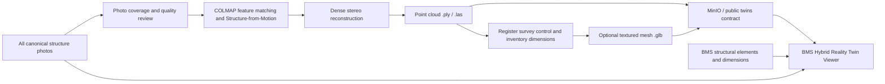
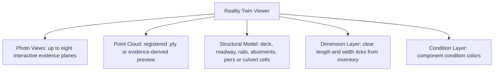

# Photogrammetry and Reality Digital Twin

## What the Reality Twin Can and Cannot Guarantee

Photogrammetry reconstructs a three-dimensional point cloud from overlapping images by estimating camera positions and matching common visual features. It can produce a highly realistic representation when photographs have sufficient overlap, sharpness, exposure consistency, and coverage.

Photographs alone do not provide a guaranteed physical scale. The Uganda BMS therefore separates:

- **BMS inventory dimensions:** authoritative recorded length, width, span count, cell count, and structural attributes.
- **Reconstructed geometry:** point-cloud or mesh geometry produced from photographs.
- **Survey control:** measured control points used to align, scale, and certify a reconstruction.

The viewer labels dimensions from the BMS inventory and never claims that an unregistered photo reconstruction is survey-certified.

## Reality Twin Architecture



## Photo Capture Requirements

For a robust reconstruction:

1. Walk or fly a complete loop around the structure where safe and legally permitted.
2. Maintain at least 70 percent overlap between adjacent images.
3. Capture deck, approaches, both elevations, underside, abutments, piers, bearings, joints, drainage, parapets, and waterway.
4. Add closer image loops for complex joints and damaged elements.
5. Avoid motion blur, heavy compression, extreme exposure changes, and moving traffic dominating the frame.
6. Include surveyed control targets visible from multiple positions.
7. Record target coordinates and independent check measurements.
8. Keep the original image files and metadata.

Existing evidence can produce useful reconstructions for structures with adequate overlap, but inspection-photo sets were not necessarily captured for photogrammetry. The manifest records whether each structure meets a minimum photo-count readiness gate; image overlap still requires review.

## Reconstruction Pipeline

Prepare all canonical source-linked photos for one structure:

```powershell
node scripts/preparePhotogrammetry.mjs B001
```

Run sparse and dense reconstruction using free open-source COLMAP:

```powershell
.\scripts\runPhotogrammetry.ps1 -StructureId B001 -Dense -Publish
```

The pipeline:

1. reads the evidence index;
2. excludes duplicate aliases;
3. copies every source-linked photo for the structure into an isolated project;
4. extracts and matches visual features;
5. estimates camera poses and sparse geometry;
6. creates a dense fused point cloud;
7. publishes `public/twins/B001/pointcloud.ply`;
8. rebuilds the reconstruction manifest.

For enterprise storage, upload the output to MinIO and register the object key in `twin.reconstruction`.

## Output Contract

```text
public/twins/
  manifest.json
  B001/
    pointcloud.ply
    textured.glb
```

`manifest.json` records:

- reconstruction status;
- point-cloud and mesh URLs;
- canonical photo count and capture years;
- inventory dimensions and their source;
- survey-control status;
- quality gates and certified-dimension status.

## Hybrid Viewer Layers



Viewer modes:

- **Hybrid:** translucent structural model, point cloud, photo viewpoints and dimension ticks.
- **Point Cloud:** reconstructed cloud or clearly labelled evidence-derived preview.
- **Structural:** clean parametric structural elements and dimensions.
- **Photo Views:** evidence views arranged around the structure.

The evidence-derived preview is a visual bridge between the current inventory and a future registered reconstruction. It is not presented as measured reality.

## Registering Accurate Dimensions

To certify the cloud:

1. Survey at least three well-distributed control points, preferably more.
2. Add independent check points not used for alignment.
3. Transform the reconstruction into the required project coordinate reference system.
4. Compare reconstructed check-point coordinates against surveyed coordinates.
5. Compare deck length, width, span locations, pier spacing, and clearance against independent measurements.
6. Record residuals and tolerance thresholds in the quality report.
7. Set `certified_dimensions=true` only after engineering review.

Recommended quality report fields:

```json
{
  "horizontal_rmse_m": 0.018,
  "vertical_rmse_m": 0.026,
  "independent_check_points": 5,
  "dimension_checks": {
    "deck_length_difference_m": 0.031,
    "deck_width_difference_m": 0.014
  },
  "reviewed_by": "Licensed surveyor or responsible engineer",
  "reviewed_at": "ISO-8601 timestamp"
}
```

## Structural Element Labelling

The current structural overlay explicitly models and identifies:

- bridge deck and roadway;
- parapet or rail lines;
- left and right abutments;
- intermediate piers based on span count;
- culvert deck and pipe or box cells;
- overall length and width dimension lines;
- component condition colors.

Future registered meshes can add element segmentation. Store each segmented element with a stable component ID linked to inspection findings, maintenance work orders, and evidence photos.

## Quality Gates

A reconstruction should not be published as authoritative when:

- there are too few or poorly overlapping photos;
- important sides or underside elements are absent;
- the cloud contains substantial noise or holes;
- survey control is absent;
- coordinate-system metadata is unknown;
- independent dimensional checks exceed the approved tolerance;
- the source photos and processing parameters are not retained.
