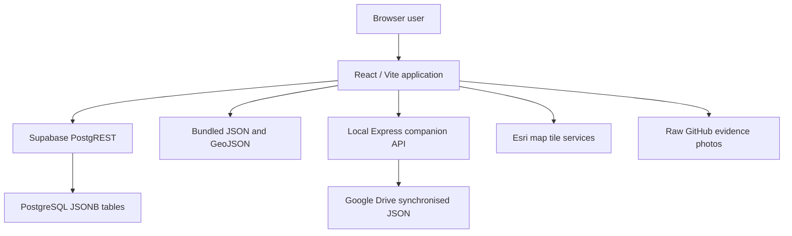

# Technical Architecture

## 1. Implemented System

The Uganda BMS is a React 19 single-page application built with Vite. It is deployed as static assets to GitHub Pages and can optionally communicate with Supabase and a local Express companion server.



## 2. Frontend Composition

Application entry:

- `src/main.jsx` mounts the React application and global styles.
- `src/App.jsx` loads the bridge and culvert datasets and presents the role-access screen.
- `src/components/modern/ModernDashboardShell.jsx` routes users between workspaces.
- `src/components/modern/ModernHorizNav.jsx` controls role-specific navigation.

Primary workspace components:

| Area | Component |
| --- | --- |
| Role access | `src/components/modern/LoginPage.jsx` |
| National overview | `src/components/BmsOverview.jsx` |
| GIS map | `src/components/MapDashboard.jsx` |
| Structure map list | `src/components/StructureListPanel.jsx` |
| Sources and evidence administration | `src/components/admin/SourcesEvidenceAdmin.jsx` |
| Structure detail | `src/components/BridgeDetailCard.jsx` |
| Inventory registers | `src/components/CombinedInventory.jsx` |
| Maintenance | `src/components/MaintenanceWorkspace.jsx` |
| Analytics | `src/components/AnalyticsDashboard.jsx` |
| Reports | `src/components/BmsReports.jsx` |
| Inventory capture | `src/components/capture/*InventoryForm.jsx` |
| Inspection capture | `src/components/capture/*InspectionForm.jsx` |
| Admin tools | `src/components/admin/*.jsx`, `UpgradeBridgesForm.jsx`, `SystemParametersForm.jsx` |

## 3. Data Access

`src/services/bmsDataService.js` is the main data-access boundary.

It also normalizes legacy snake-case bridge imports and existing culvert records into the stable UI contract (`BridgeNumber`, `BridgeName`, `LegacyData`, `Traffic`, coordinates, condition fields, and equivalent culvert fields). Original source fields remain available on each record.

### Read order

When `VITE_BMS_DATA_SOURCE` is `auto`, bridge and culvert reads:

1. Attempt Supabase PostgREST.
2. Fall back to bundled JSON when Supabase is unavailable or empty.

When `VITE_BMS_DATA_SOURCE` is `static`, the application reads bundled JSON directly.

### Write order

Bridge and culvert saves:

1. Attempt a Supabase JSONB upsert when the data source is not `static`.
2. Attempt the local companion API if the Supabase write fails.
3. Return a visible error when both writes fail.

### Supabase model

Core tables use a stable text ID and a JSONB payload:

```sql
create table public.bridges (
  id text primary key,
  data jsonb not null,
  updated_at timestamptz not null default now()
);
```

This model preserves heterogeneous legacy fields while allowing gradual normalisation through views and future migrations.

### Local companion server

`server/bridgeSyncServer.cjs` provides:

- `GET /api/health`
- `GET /api/bridges`
- `POST /api/bridges`
- `POST /api/bridges/upsert`
- Equivalent culvert endpoints

Writes use a temporary file followed by rename to reduce the risk of partial JSON files.

## 4. Static Data and Spatial Layers

The application ships read-only fallback data in `public/data`.

Key files:

- `bridges.json`
- `culverts.json`
- `critical_structures.json`
- `analytics.json`
- `bridge_works.json`
- `road_network.json`
- `spatial/bridges.geojson`
- `spatial/major_culverts.geojson`
- `spatial/network2026_light.geojson`
- `spatial/water.geojson`

The map uses Leaflet/React Leaflet, Esri imagery and label tiles, and the bundled GeoJSON overlays.

## 5. Evidence Photos

`public/gallery/index.json` maps evidence-photo files to structure IDs.

During local development, photos resolve from the local `public/gallery/images` directory.

During a production build, `src/utils/photoUrlResolver.js` resolves photos from the raw GitHub main branch. `scripts/prunePagesGallery.mjs` removes the large photo directory from the GitHub Pages artifact while preserving the complete searchable photo index.

## 6. Security Boundary

### Current state

- The live site is a public static GitHub Pages application.
- The login screen implements client-side role selection.
- Role codes and UI checks are delivered to the browser.
- Supabase anonymous reads are enabled.
- Supabase anonymous writes are denied by the default schema.

Therefore, the role screen controls interface visibility but is **not a security boundary**.

### Production requirements

Before enabling internet-facing writes:

1. Replace the client-side role gate with Supabase Auth, an organisational identity provider, or another server-validated identity system.
2. Enforce role permissions in database Row Level Security policies or a secured API.
3. Keep service-role keys out of browser bundles and source control.
4. Add audit records for create, update, inspection, configuration, and approval actions.
5. Restrict CORS on the local companion API.
6. Add backup, retention, and recovery procedures.

Do not apply `supabase/anon-write-policy.local-only.sql` to a public production database unless anonymous editing is explicitly intended.

## 7. Implemented Versus Target Capabilities

| Capability | Status |
| --- | --- |
| Static public dashboard | Implemented |
| Supabase read fallback | Implemented |
| Bridge and culvert Supabase/local save path | Implemented, dependent on backend permissions |
| GIS map and structure detail | Implemented |
| Inventory and inspection capture | Implemented |
| Maintenance, analytics, and reports | Implemented |
| Persistent upgrades | Interface only |
| Persistent system parameters | Interface only |
| Real user authentication and authorisation | Not implemented |
| Offline IndexedDB sync queue | Not implemented |
| API rate limiting | Not implemented |
| GraphQL API | Not implemented |
| Automated approval workflow | Not implemented |
| Complete action audit log | Not implemented |

## 8. Styling

Global visual layers are loaded from:

- `src/index.css`
- `src/operational.css`
- `src/capture.css`
- `src/classic-bms.css` where applicable

The application combines a light operational dashboard with full-height data-entry workspaces.

## 9. Build and Deployment

Vite is configured with:

```js
base: '/uganda_bms/'
```

This base path is required because the application is hosted under the GitHub Pages project path.

`npm run build:pages`:

1. Creates the Vite production build.
2. Removes the large local evidence-photo payload.
3. Removes extracted offline data not required by the public artifact.
4. Writes the reduced gallery index.

See [Operations and Deployment](OPERATIONS_AND_DEPLOYMENT.md) for the release procedure.
